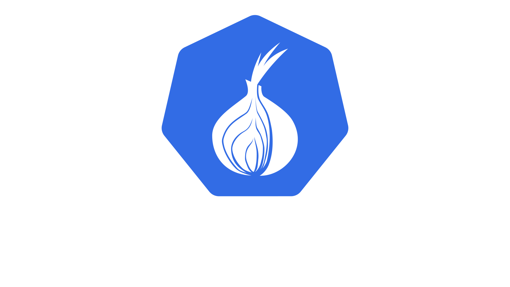

<h1 align="center"><b>tor-controller</b></h1>

<p align="center">
  
</p>

[](https://github.com/bugfest/tor-controller/actions/workflows/main.yml)
[](https://github.com/bugfest/tor-controller/actions/workflows/main-tag.yml)
[](https://github.com/bugfest/tor-controller/actions/workflows/release.yml)
[](https://github.com/bugfest/tor-controller/actions/workflows/pages/pages-build-deployment)

`Tor-controller` lets you define Tor instances in your k8s using a set of provided custom resource definitions (`tor`, `onion`, `onionha`).

Compatible architectures: `amd64`, `arm64`, `arm`

Usage examples:

- Deploy a Tor daemon that listens for socks connections so you can let your k8s applications fetch resources through the Tor network.
- Run a `bridge`, `relay` or `exit` node
- Expose your k8s service in the Tor network as onion service.
  - If you want HA you can expose it with an onion balancer (allowing you to run up to 10 onion virtual services behind a single `.onion` address)  
  - Enable metrics and visualize them via prometheus/grafana

**NOTE**: This project started as an exercise to update `kragniz`'s https://github.com/kragniz/. This version is a complete reimplementation.

# Quick start

```bash
helm repo add bugfest https://bugfest.github.io/tor-controller

helm repo update

helm upgrade \
  --install \
  --create-namespace \
  --namespace tor-controller \
  tor-controller \
  bugfest/tor-controller
```

Check [install section](#install) bellow for more information.

# Table of Contents

- [Quick start](#quick-start)
- [Table of Contents](#table-of-contents)
  - [Changes](#changes)
  - [Roadmap / TODO](#roadmap--todo)
  - [Install](#install)
  - [Resources](#resources)
  - [How to](#how-to)
  - [Quickstart with random onion address](#quickstart-with-random-onion-address)
  - [Onion service versions](#onion-service-versions)
  - [Random service names](#random-service-names)
  - [Bring your own secret](#bring-your-own-secret)
  - [Enable Onion Service protection with Authorization Clients](#enable-onion-service-protection-with-authorization-clients)
  - [Custom settings for Tor daemon](#custom-settings-for-tor-daemon)
  - [Specifying Tor network bridges](#specifying-tor-network-bridges)
  - [Specify Pod Template Settings](#specify-pod-template-settings)
  - [OnionBalancedService Pod Template](#onionbalancedservice-pod-template)
  - [Using with nginx-ingress](#using-with-nginx-ingress)
  - [HA Onionbalance Hidden Services](#ha-onionbalance-hidden-services)
  - [Tor Instances](#tor-instances)
  - [Service Monitors](#service-monitors)
- [Tor](#tor)
- [How it works](#how-it-works)
  - [Builds](#builds)
  - [Versions](#versions)
  - [References](#references)
  - [Documentation](#documentation)
  - [Utils](#utils)
  - [Other projects](#other-projects)

Changes
-------

Full changelog: [CHANGELOG](CHANGELOG.md)

- **v0.0.x**
  - Go updated to `1.17`
  - Code ported to kubebuilder version `3`
  - Domain updated moved from `tor.k8s.io` (protected) to `k8s.torproject.org` (see https://github.com/kubernetes/enhancements/pull/1111)
  - Added `OnionBalancedService` type
  - New OnionService version v1alpha2
  - Migrate clientset code to controller-runtime
- **v0.3.x**
  - Helm chart
  - MultiArch images. Supported architectures: amd64, arm, arm64
- **v0.4.x**
  - Implement `OnionBalancedService` resource (HA Onion Services)
- **v0.5.x**
  - Tor & OnionBalance metric exporters. Prometheus ServiceMonitor integration
  - Bring your own secret key
- **v0.6.x**
  - Support specifying PodSpec properties on the OnionService/OnionBalancer pods
  - Tor instance CRD supporting custom config and Client/Server/Metrics/Control ports
- **v0.7.x**
  - Onion Service's authorized clients support
- **v0.8.x**
  - Namespaced deployments
- **v0.9.x**
  - Controller deployment automatic rollout on chart upgrade
  - Upgraded Tor daemon to 0.4.7.x
  - Bridges support (obfs4 pluggable transport shipped alongside Tor daemon)
  - Implemented ExtraConfig in OnionService

Roadmap / TODO
--------------

- Tor daemon management via socket (e.g: config reload)
- Manage Tor Server fingerprinting (ed25519_master_id_secret_key, secret_id_key) and automatic family and nickname management
- Tor relays:
  - Non exit: Bridge, Snowflake, Middle/Guard
  - Exit relay: Tor Exit
- Tor-Istio plugin/extension to route pod egress traffic thru Tor
- Automated Vanguards Tor Add-on deploy/setup

Install
-------

Using helm (recommended):

```bash
helm repo add bugfest https://bugfest.github.io/tor-controller
helm repo update
helm upgrade --install \
  --create-namespace --namespace tor-controller \
  tor-controller bugfest/tor-controller
```

For namespaced deployments add `--set namespaced=true` to helm's command when deploying.
Check [charts/tor-controller/README.md](charts/tor-controller/README.md) for a full set of available options.

Install tor-controller directly using the manifest (cluster-scoped):

```bash
kubectl apply -f https://raw.githubusercontent.com/bugfest/tor-controller/master/hack/install.yaml
```

Resources
---------

| Name                  | Shortnames      | Api Version                     | Namespaced | Kind                 |
| --------------------- | --------------- | ------------------------------- | :--------: | -------------------- |
| tors                  | tor             | tor.k8s.torproject.org/v1alpha2 |    true    | Tor                  |
| onionservices         | onion,os        | tor.k8s.torproject.org/v1alpha2 |    true    | OnionService         |
| onionbalancedservices | onionha,oha,obs | tor.k8s.torproject.org/v1alpha2 |    true    | OnionBalancedService |
| projectconfigs        |                 | config.k8s.torproject.org/v2    |    true    | ProjectConfig        |

***Tor***: Tor instance you can use to route traffic to/thru Tor network

**OnionService**: Exposes a set of k8s services using as a Tor Hidden Service. By default it generates a random .onion address

**OnionBalancedService**: Exposes a set of k8s services using [Onionbalance](https://gitlab.torproject.org/tpo/onion-services/onionbalance.git). It creates multiple backends providing some sort of HA. Users connect to the OnionBalancedService address and the requests are managed by one of the registered backends.

How to
------

Some examples you can use to start using tor-controller in your cluster

Quickstart with random onion address
------------------------------------

TLDR

```bash
kubectl apply -f hack/sample/full-example-private.yaml

kubectl get onion
```

Create some deployment to test against, in this example we'll deploy an echoserver. You can find the definition at [hack/sample/echoserver.yaml](hack/sample/echoserver.yaml):

Apply it:

    kubectl apply -f hack/sample/echoserver.yaml

For a fixed address, we need a private key. This should be kept safe, since
someone can impersonate your onion service if it is leaked. Tor-Controller will generate an Onion v3 key-pair for you (stored as a secret), unless it already exists

Create an onion service, [hack/sample/onionservice.yaml](hack/sample/onionservice.yaml), referencing an existing private key is optional:

```yaml
apiVersion: tor.k8s.torproject.org/v1alpha2
kind: OnionService
metadata:
  name: example-onion-service
spec:
  version: 3
  rules:
    - port:
        number: 80
      backend:
        service:
          name: http-app
          port:
            number: 8080
```

Apply it:

    kubectl apply -f hack/sample/onionservice.yaml

List active OnionServices:

```bash
$ kubectl get onionservices
NAME                    HOSTNAME                                                         TARGETCLUSTERIP   AGE
example-onion-service   cfoj4552cvq7fbge6k22qmkun3jl37oz273hndr7ktvoahnqg5kdnzqd.onion   10.43.252.41      1m
```

**Note**: you can also the alias `onion` or `os` to interact with these resources. Example: `kubectl get onion`

This service should now be accessible from any tor client,
for example [Tor Browser](https://www.torproject.org/projects/torbrowser.html.en):

Onion service versions
----------------------

The `spec.version` field specifies which onion protocol to use.
Only v3 is supported.

tor-controller defaults to using v3 if `spec.version` is not specified.

Random service names
--------------------

If `spec.privateKeySecret` is not specified, tor-controller will start a service with a random name. The key-pair is stored in the same namespace as the tor-daemon, with the name `ONIONSERVICENAME-tor-secret`

The created secret has the following format:

```yaml
apiVersion: v1
kind: Secret
type: tor.k8s.torproject.org/onion-v3
metadata:
  name: example-tor-secret
data:
  onionAddress: ZWxqZGU2a...
  privateKey: oMLf2tSS2...
  privateKeyFile: PT0gZW...
  publicKey: ItIyeT+kH...
  publicKeyFile: PT0gZWQyNT...
...
```

Bring your own secret
---------------------

Set `spec.privateKeySecret.name` to specify an existing secret. If you don't set `spec.privateKeySecret.key`, the controller expects it to have the following keys:

- `onionAddress` (corresponds to is the `hostname` file usually created by Tor)
- `privateKeyFile` (corresponds to `hs_ed25519_secret_key` file in v3 onion addresses or `private_key` in v2 ones)
- `publicKeyFile` (corresponds to `hs_ed25519_public_key` file in v3 onion addresses or `public_key` in v2 ones)

You can create such a secret with the following command:

```bash
$ kubectl create secret generic my-full-onion-secret \
  --from-file=privateKeyFile=hs_ed25519_secret_key \
  --from-file=publicKeyFile=hs_ed25519_public_key \
  --from-file=onionAddress=hostname
```

Onion Service example referencing a Secret only by name:

```yaml
apiVersion: tor.k8s.torproject.org/v1alpha2
kind: OnionService
metadata:
  name: example-onion-service
spec:
  ...
  privateKeySecret:
    name: my-full-onion-secret
```

If you set `spec.privateKeySecret.key`, the controller expects it to point to a valid `hs_ed25519_secret_key` content.

Secret example:

```bash
$ kubectl create secret generic my-private-onion-secret \
  --from-file=mykeyname=hs_ed25519_secret_key
```

Onion Service example referencing a Secret only by name:

```yaml
apiVersion: tor.k8s.torproject.org/v1alpha2
kind: OnionService
metadata:
  name: example-onion-service
spec:
  ...
  privateKeySecret:
    name: my-private-onion-secret
    key: mykeyname
```

Enable Onion Service protection with Authorization Clients
----------------------------------------------------------

(Available since v0.7.0)

Use `spec.authorizedClients` to set a list of references to secrets objects containing valid authentication credentials:

```yaml
apiVersion: tor.k8s.torproject.org/v1alpha2
kind: OnionService
metadata:
  name: example-onion-service
spec:
  ...
  authorizedClients:
  - name: my-authorized-client-secret
```

A valid secret that can be used for this purpose has the following format:

```yaml
apiVersion: v1
kind: Secret
metadata:
  name: my-authorized-client-secret
data:
  publicKey: ...
  # authKey: ...
```

Where `publicKey` is a x25519 public key encoded in base32 (`<base32-encoded-public-key>`).

Alternatively, you can set `authKey` instead with the long form `<auth-type>:<key-type>:<base32-encoded-public-key>`,
where `<auth-type>` is: `descriptor` and `<key-type>` is: `x25519`.

A more complete example can be found at [hack/sample/onionservice-authorizedclients.yaml](hack/sample/onionservice-authorizedclients.yaml).

Check https://community.torproject.org/onion-services/advanced/client-auth/
to learn how to create valid key pairs for client authorization.

Custom settings for Tor daemon
------------------------------

Tor Controller CRDs allows adding extra parameters that will be passed to the Tor daemon:

- Tor daemons: use `spec.config` field
- Onion Services: use `spec.extraConfig` field
- Onion Balanced Services: use `spec.template.extraConfig` field

Specifying Tor network bridges
-------------------------------

Prerequisite: bridges information. You can get `obfs4` bridges visiting https://bridges.torproject.org/bridges/?transport=obfs4

Tor daemon instance [example](./hack/sample/tor-custom-config-bridges.yaml). Set the `config` field with the following content:

1. Enable bridges adding the line `UseBridges 1`
2. Place your bridges configuration

```yaml
apiVersion: tor.k8s.torproject.org/v1alpha2
kind: Tor
metadata:
  name: example-tor-instance-custom-bridges
spec:
  config: |
    UseBridges 1
    # Bridge obfs4 xxx.xxx.xxx.xxxx:xxxx C2541... cert=7V57Z... iat-mode=0
    # Bridge obfs4 xxx.xxx.xxx.xxxx:xxxx C1CCA... cert=RTTE2... iat-mode=0
    # Bridge obfs4 xxx.xxx.xxx.xxxx:xxxx B6432... cert=hoGth... iat-mode=0

    # ... other configurations
```

Specify Pod Template Settings
-----------------------------

The `spec.template` field can be used to specify properties for the running tor-service pods.
Use `spec.template.resources` to specify the compute resources required by the tor containers that will be created.

```yaml
apiVersion: tor.k8s.torproject.org/v1alpha2
kind: OnionService
metadata:
  name: example-onion-service
spec:
  ...
  template:
    metadata:
      annotations:
        some-special-anotation: my-value
    spec:
      # nodeSelector:
      # affinity:
      # schedulerName:
      # tolerations:
      # priorityClassName:
      # runtimeClassName:
      # topologySpreadConstraints:
    resources:
      limits:
        cpu: 500m
        memory: 128Mi
```

| Template Property                | Description                                                                                                                                                                                                  |
| -------------------------------- | ------------------------------------------------------------------------------------------------------------------------------------------------------------------------------------------------------------ |
| `metadata.annotations`           | Add pod [Annotations](https://kubernetes.io/docs/concepts/overview/working-with-objects/annotations/).                                                                                                       |
| `metadata.labels`                | Add pod [Labels](https://kubernetes.io/docs/concepts/overview/working-with-objects/labels/). NOTE: `tor-controller` automatically adds the labels `app` and `controller`, so you should not set these labels |
| `spec.nodeSelector`              | Set specific [Node Selectors](https://kubernetes.io/docs/concepts/scheduling-eviction/assign-pod-node/#nodeselector) for the pod.                                                                            |
| `spec.affinity`                  | Add pod or node [affinity](https://kubernetes.io/docs/concepts/scheduling-eviction/assign-pod-node/#affinity-and-anti-affinity) rules here.                                                                  |
| `spec.schedulerName`             | Select a specific [scheduler](https://kubernetes.io/docs/concepts/scheduling-eviction/kube-scheduler/) to be used for service pods                                                                           |
| `spec.tolerations`               | Add [tolerations](https://kubernetes.io/docs/reference/generated/kubernetes-api/v1.24/#toleration-v1-core) to the pods.                                                                                      |
| `spec.runtimeClassName`          | Set the pods [Runtime Class](https://kubernetes.io/docs/concepts/containers/runtime-class/).                                                                                                                 |
| `spec.priorityClassName`         | Set the pods [Priority Class](https://kubernetes.io/docs/concepts/scheduling-eviction/pod-priority-preemption/#priorityclass)                                                                                |
| `spec.resources`                 | Set [Resource Requirements](https://kubernetes.io/docs/concepts/configuration/manage-resources-containers/#resource-requests-and-limits-of-pod-and-container) for the running containers.                    |
| `spec.topologySpreadConstraints` | Add [Topology Spread Constraints](https://kubernetes.io/docs/concepts/workloads/pods/pod-topology-spread-constraints/).                                                                                      |
| `resources`                      | Set [Resource Requirements](https://kubernetes.io/docs/concepts/configuration/manage-resources-containers/#resource-requests-and-limits-of-pod-and-container) for the running containers.                    |

OnionBalancedService Pod Template
---------------------------------

In addition to creating backend `OnionServices`, a OnionBalancedService also creates a deployment that runs the Onion Balancer.  To modify the pod settings for the balancer service, you can specify the a `balancerTemplate` property in the `OnionBalancedServie` spec.

```yaml
apiVersion: tor.k8s.torproject.org/v1alpha2
kind: OnionBalancedService
metadata:
  name: example-onion-service
spec:
  ...
  balancerTemplate:
    spec:
      # nodeSelector:
      # affinity:
      # schedulerName:
      # tolerations:
      # priorityClassName:
      # runtimeClassName:
```

Additionally, the Onion Balancer pod contains two separate containers, which can each have their resource requirements set via `spec.balancerTemplate.torResources` and `spec.balancerTemplate.balancerResources`.

```yaml
apiVersion: tor.k8s.torproject.org/v1alpha2
kind: OnionBalancedService
metadata:
  name: example-onion-service
spec:
  ...
  balancerTemplate:
    torResources:
      limits:
        cpu: 500m
        memory: 128Mi
    balancerResources:
      limits:
        cpu: 500m
        memory: 128Mi
```

Using with nginx-ingress
------------------------

**WARNING**: This example exposes the service to both clearnet (Internet) and Tor

tor-controller on its own simply directs TCP traffic to a backend service.
If you want to serve HTTP stuff, you may want to pair it with
nginx-ingress or some other ingress controller.

To do this, first install nginx-ingress normally. Then point an onion service
to your nginx-ingress' controller (find it with `kubectl get svc`), for example:

```yaml
apiVersion: tor.k8s.torproject.org/v1alpha2
kind: OnionService
metadata:
  name: ingress-example-onion-service
spec:
  version: 3
  rules:
    - port:
        number: 80
      backend:
        service:
          # This name will depend on your ingress installation
          # For example, for nginx's ingress installation using helm
          # the name template is [release-name]-nginx-ingress
          #
          # I used this commands:
          # $ helm repo add nginx-stable https://helm.nginx.com/stable
          # $ helm install nginx-ingress nginx-stable/nginx-ingress
          name: nginx-ingress-nginx-ingress
          port:
            number: 80
```

This can then be used in the same way any other ingress is. You can find a full
example, with a default backend at [hack/sample/full-example.yaml](hack/sample/full-example.yaml)

HA Onionbalance Hidden Services
-------------------------------

(Available since v0.4.0)

Create an onion balanced service, e.g: [hack/sample/onionbalancedservice.yaml](hack/sample/onionbalancedservice.yaml). `spec.replicas` is the number of backends that will be deployed. An additional `onionbalance` pod will be created to act as frontend. The `spec.template.spec` follows the definition of `OnionService` type.

```
apiVersion: tor.k8s.torproject.org/v1alpha2
kind: OnionBalancedService
metadata:
  name: example-onionbalanced-service
spec:
  replicas: 2
  template:
    spec:
      ...
```

Apply it:

    kubectl apply -f hack/sample/onionbalancedservice.yaml

List the frontend onion:

```bash
$ kubectl get onionha
NAME                            HOSTNAME                                                         REPLICAS   AGE
example-onionbalanced-service   gyqyiovslcdv3dawfjpewit4vrobf2r4mcmirxqhwrvviv3wd7zn6sqd.onion   2          1m
```

List the backends:

```bash
$ kubectl get onion
NAME                                  HOSTNAME                                                         TARGETCLUSTERIP   AGE
example-onionbalanced-service-obb-1   dpyjx4jv7apmaxy6fl5kbwwhr7sfxmowfi7nydyyuz6npjksmzycimyd.onion   10.43.81.229      1m
example-onionbalanced-service-obb-2   4r4n25aewayyupxby34bckljr5rn7j4xynagvqqgde5xehe4ls7s5qqd.onion   10.43.105.32      1m
```

**Note**: you can also the alias `onionha` or `obs` to interact with OnionBalancedServices resources. Example: `kubectl get onionha`

Tor Instances
-------------

(Available since v0.6.1)

Create a Tor instance, e.g: [hack/sample/tor.yaml](hack/sample/tor.yaml).

```
apiVersion: tor.k8s.torproject.org/v1alpha2
kind: Tor
metadata:
  name: example-tor-instance
# spec:
#   ...
```

Apply it:

    kubectl apply -f hack/sample/tor.yaml

List the tor instances:

```bash
$ kubectl get tor
NAME                          AGE
example-tor-instance          45m
```

Use it with socks via service:

```bash
$ kubectl run -ti curl --image=curlimages/curl:latest --restart=Never --rm -- -v -x socks://example-tor-instance-tor-svc:9050 ipinfo.io/ip
If you don't see a command prompt, try pressing enter.
* SOCKS4 request granted.
* Connected to example-tor-instance-tor-svc (10.43.175.28) port 9050 (#0)
> GET /ip HTTP/1.1
> Host: ipinfo.io
...
* Connection #0 to host example-tor-instance-tor-svc left intact
198.96.155.3
```

Other examples:

- Use `spec.config` to add your customized configuration (Example: [hack/sample/tor-custom-config.yaml](hack/sample/tor-custom-config.yaml)).

- Set `spec.control.enable` to `true` to enable Tor's control port. If you don't set `spec.control.secret` or `spec.control.secretRef` a random password will be set and stored in a secret object. Example: [hack/sample/tor-custom-config.yaml](hack/sample/tor-external-full.yaml). In this example, the generated password can be retrieved with:

```bash
echo $(kubectl get secret/example-tor-instance-full-tor-secret -o jsonpath='{.data.control}' | base64 -d)
```

Service Monitors
----------------

You can get Service Monitors created automatically for `Tor`, `OnionService` and `OnionBalancedService` objects setting `serviceMonitor` to `true`. It will be used by prometheus to scrape metrics.

Examples:

- `Tor`: [tor-monitored.yaml](hack/sample/tor-monitored.yaml)
- `OnionService`: [onionservice-monitored.yaml](hack/sample/onionservice-monitored.yaml)
- `OnionBalancedService`: [onionbalancedservice-monitored.yaml](hack/sample/onionbalancedservice-monitored.yaml)

# Tor

Tor is an anonymity network that provides:

- privacy
- enhanced tamperproofing
- freedom from network surveillance
- NAT traversal

tor-controller allows you to create `OnionService` resources in kubernetes.
These services are used similarly to standard kubernetes services, but they
only serve traffic on the tor network (available on `.onion` addresses).

See [this page](https://www.torproject.org/docs/onion-services.html.en) for
more information about onion services.

HA Hidden Services are implemented by [OnionBalance](https://gitlab.torproject.org/tpo/onion-services/onionbalance). Implements round-robin like load balancing on top of Tor onion services. A typical Onionbalance deployment will incorporate one frontend servers and multiple backend instances.` https://onionbalance.readthedocs.io/en/latest/v3/tutorial-v3.html

# How it works

tor-controller creates the following resources for each OnionService:

- tor pod, which contains a tor daemon to serve incoming traffic from the tor
  network, and a management process that watches the kubernetes API and
  generates tor config, signaling the tor daemon when it changes
- rbac rules

Builds
------

| Name                     | Type  | URL                                                         | Comment                    |
| ------------------------ | :---: | ----------------------------------------------------------- | -------------------------- |
| helm release             | helm  | https://bugfest.github.io/tor-controller                    |                            |
| tor-controller           | image | https://quay.io/repository/bugfest/tor-controller           |                            |
| tor-daemon               | image | https://quay.io/repository/bugfest/tor-daemon               | Build requires bugfest/tor |
| tor-daemon-manager       | image | https://quay.io/repository/bugfest/tor-daemon-manager       | Build requires bugfest/tor |
| tor-onionbalance-manager | image | https://quay.io/repository/bugfest/tor-onionbalance-manager |                            |
| tor                      | image | https://quay.io/repository/bugfest/tor                      |                            |

Dependencies:

- tor-daemon-manager Dockerfile uses bugfest/tor image (built from source). It is built in a separate project to speed up the compilation: [https://github.com/bugfest/tor-docker](https://github.com/bugfest/tor-docker)

Versions
--------

| Helm Chart version | Tor-Controller version | Tor daemon | Pluggable transports |
| ------------------ | ---------------------- | ---------- | -------------------- |
| 0.1.0              | 0.3.1                  | 0.4.6.8    |                      |
| 0.1.1              | 0.3.2                  | 0.4.6.8    |                      |
| 0.1.2              | 0.4.0                  | 0.4.6.8    |                      |
| 0.1.3              | 0.5.0                  | 0.4.6.10   |                      |
| 0.1.4              | 0.5.1                  | 0.4.6.10   |                      |
| 0.1.5              | 0.6.0                  | 0.4.6.10   |                      |
| 0.1.6              | 0.6.1                  | 0.4.6.10   |                      |
| 0.1.7              | 0.7.0                  | 0.4.6.10   |                      |
| 0.1.8              | 0.7.1                  | 0.4.6.10   |                      |
| 0.1.9              | 0.7.2                  | 0.4.6.10   |                      |
| 0.1.10             | 0.8.0                  | 0.4.6.10   |                      |
| 0.1.11             | 0.9.0                  | 0.4.7.13   | Obfs4-0.0.14         |
| 0.1.12             | 0.9.1                  | 0.4.7.13   | Obfs4-0.0.14         |
| 0.1.13             | 0.9.1                  | 0.4.7.13   | Obfs4-0.0.14         |
| 0.1.14             | 0.9.2                  | 0.4.7.13   | Obfs4-0.0.14         |
| 0.1.15             | 0.10.0                 | 0.4.8.9    | Obfs4-0.0.14         |

References
----------

## Documentation

- Tor man pages: https://manpages.debian.org/testing/tor/tor.1.en.html
- Onionbalance: https://gitlab.torproject.org/tpo/onion-services/onionbalance
- Onionbalance tutorial: https://onionbalance.readthedocs.io/en/latest/v3/tutorial-v3.html
- Obfs4 pluggable transport: https://gitlab.torproject.org/tpo/anti-censorship/pluggable-transports/obfs4

## Utils

- Helm docs updated with https://github.com/norwoodj/helm-docs

## Other projects

- https://github.com/rdkr/oniongen-go
- https://github.com/ajvb/awesome-tor
